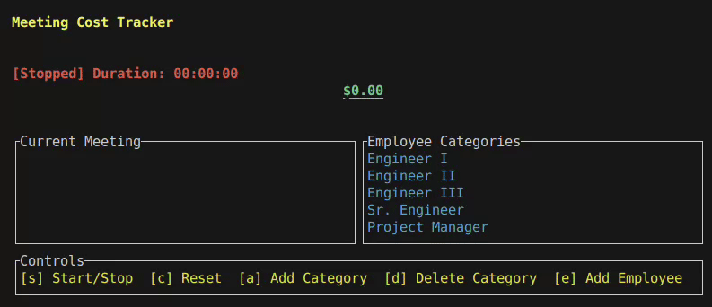

# Meeting Cost Tracker
[](https://crates.io/crates/{project-name})
[](https://docs.rs/{project-name})
[](https://github.com/Andrewsimsd/{project-name}/actions)
[](LICENSE)
[](https://github.com/Andrewsimsd/{project-name})

**Name** description 



## Installation

### From crates.io


### From source


## Example

```rust

```

## See Also


## License

Licensed under either the MIT license or Apache License 2.0 at your option.

